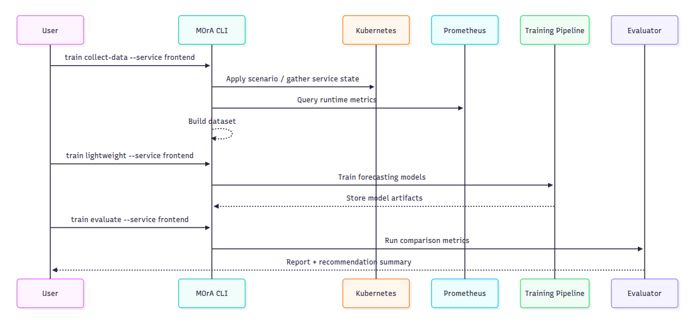

# MOrA: Microservice Orchestration and Rightsizing Agent

MOrA is a Python-based system for collecting runtime metrics from Kubernetes microservices, training forecasting models, and producing practical CPU, memory, and replica recommendations.

It is designed around reproducible experiments, operational visibility, and a command-line workflow that can run on local Minikube environments.

## What This Project Does

- Collects service-level runtime data from Kubernetes and Prometheus.
- Runs controlled load scenarios to build training datasets.
- Trains forecasting pipelines (lightweight and full variants).
- Evaluates model quality and generates comparison reports.
- Supports recommendation workflows for resource rightsizing.

## Architecture at a Glance

The system is organized as four layers:

1. **Data Acquisition**: metric collection, scenario execution, and dataset generation.
2. **Model Training**: lightweight and full training pipelines.
3. **Evaluation**: comparative analysis and report generation.
4. **Operations**: CLI commands, health checks, and deployment helpers.

### Visual Overview




Detailed design docs are available in `docs/Architecture.md` and `docs/ML-Pipeline.md`.

## Tech Stack

- Python 3.8+
- Kubernetes (Minikube for local setup)
- Prometheus + Grafana
- JMeter (load generation)
- TensorFlow / Prophet / scikit-learn based modeling

## Repository Structure

```text
.
├── src/                    # Core application code
├── train_models/           # Model training modules
├── evaluate_models/        # Evaluation and analysis scripts
├── config/                 # Runtime and evaluation configuration
├── scripts/                # Setup, verification, and utility scripts
├── tests/                  # Unit and integration tests
├── docs/                   # Project documentation
├── docker-compose.yml
├── docker-compose.prod.yml
├── Dockerfile
└── k8s/
```

## Quick Start

### 1) Install dependencies

```bash
git clone https://github.com/dheeraj-vp/Microservice-Orchestration-and-Rightsizing-Agent.git
cd Microservice-Orchestration-and-Rightsizing-Agent
python3 -m pip install -r requirements.txt
```

### 2) Prepare local environment

```bash
./scripts/setup-minikube.sh
./scripts/verify-setup.sh
```

### 3) Run a basic workflow

```bash
# Check system status
python3 -m src.mora.cli.main status

# Collect data
python3 -m src.mora.cli.main train collect-data --service frontend

# Train lightweight models
python3 -m src.mora.cli.main train lightweight --service frontend

# Evaluate results
python3 -m src.mora.cli.main train evaluate --service frontend
```

## Common Commands

### Data collection

```bash
python3 -m src.mora.cli.main train collect-data --service frontend
python3 -m src.mora.cli.main train collect-data-parallel --services frontend,cartservice --max-workers 1
python3 -m src.mora.cli.main train status --service frontend
```

### Training

```bash
# Lightweight pipeline
python3 -m src.mora.cli.main train lightweight --service frontend

# Full pipeline
python3 -m src.mora.cli.main train models --service frontend --config config/professional_ml_config.json
```

### Evaluation

```bash
python3 -m src.mora.cli.main train evaluate --service frontend
python3 -m src.mora.cli.main train evaluate --all
python3 evaluate_models/industry_standards_analysis.py
```

### Monitoring and validation

```bash
./scripts/verify-setup.sh
./scripts/check_system_resources.sh
python3 -m pytest tests/
```

## Configuration

Key config files:

- `config/default.yaml`: base/default runtime configuration
- `config/resource-optimized.yaml`: lower-resource collection profile
- `config/evaluation-config.yaml`: evaluation workflow configuration
- `config/professional_ml_config.json`: full training pipeline settings

## Documentation

- `docs/Setup.md`: installation and environment setup
- `docs/User-Guide.md`: end-to-end usage workflows
- `docs/API-Reference.md`: CLI and API details
- `docs/Architecture.md`: architecture and data flow
- `docs/ML-Pipeline.md`: training and evaluation pipeline internals
- `docs/DEVOPS.md`: Docker, Compose, Kubernetes, and operations
- `docs/EVALUATION-RESULTS.md`: summarized evaluation outputs

## Testing

```bash
python3 -m pytest tests/
```

For targeted runs, see `tests/README.md`.

## License

Add a license file (for example `LICENSE`) before publishing publicly.
