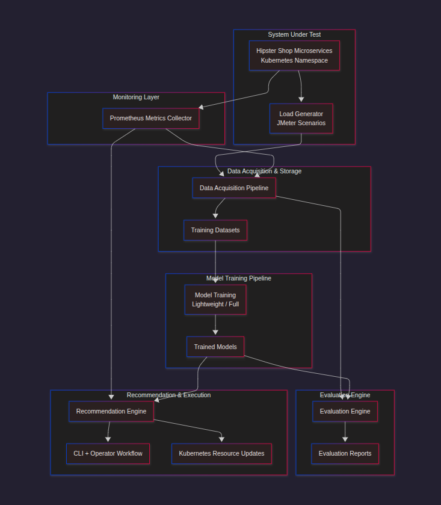

# MOrA Architecture Overview

## Table of Contents
1. [System Architecture](#system-architecture)
2. [Component Architecture](#component-architecture)
3. [Data Flow Architecture](#data-flow-architecture)
4. [ML Pipeline Architecture](#ml-pipeline-architecture)
5. [Deployment Architecture](#deployment-architecture)
6. [Security Architecture](#security-architecture)
7. [Scalability Architecture](#scalability-architecture)
8. [Monitoring Architecture](#monitoring-architecture)

## System Architecture

### Visual Architecture Diagram




### Architecture Principles

#### 1. Microservices Architecture
- **Service Isolation**: Each component operates independently
- **Loose Coupling**: Components communicate through well-defined interfaces
- **Fault Tolerance**: System continues operating if individual components fail
- **Scalability**: Components can be scaled independently

#### 2. Event-Driven Architecture
- **Asynchronous Processing**: Non-blocking operations for better performance
- **Event Sourcing**: All state changes are captured as events
- **Reactive Programming**: System responds to changes in real-time
- **Message Passing**: Components communicate through events

#### 3. Data-Centric Design
- **Data as First-Class Citizen**: Data drives all system decisions
- **Immutable Data**: Historical data is preserved for analysis
- **Data Quality**: Comprehensive validation and quality checks
- **Data Lineage**: Full traceability of data transformations


### Component Interactions

#### 1. Data Flow Interactions
```python
# Data Collection Flow
DataAcquisitionPipeline → PrometheusClient → MetricsCollection
                     ↓
LoadGenerator → JMeterScripts → LoadTesting
                     ↓
DataProcessing → QualityValidation → UnifiedStorage
```

#### 2. ML Pipeline Interactions
```python
# Model Training Flow
DataLoading → FeatureEngineering → ProphetTraining
           ↓
DataLoading → FeatureEngineering → LSTMTraining
           ↓
ProphetResults + LSTMResults → FusionEngine → Recommendations
```

#### 3. Control Flow Interactions
```python
# CLI Control Flow
CLICommand → Orchestrator → TaskExecution → ResultReporting
          ↓
CLICommand → Monitor → StatusCheck → HealthReporting
```


### Data Processing Pipeline

#### 1. Raw Data Collection
- **Prometheus Metrics**: 12 comprehensive metrics per service
- **Load Test Results**: JMeter performance data
- **System Metrics**: Node-level resource utilization
- **Context Data**: Experiment parameters and configuration

#### 2. Data Validation
- **Completeness Check**: Ensures all metrics are collected
- **Quality Validation**: Coefficient of variation checks
- **Stability Analysis**: Filters unstable data points
- **Error Handling**: Graceful degradation for missing data

#### 3. Feature Engineering
- **Target Creation**: CPU, Memory, Replica targets with buffering
- **Context Features**: Load levels, replica counts, scenarios
- **Derived Metrics**: Network activity, processing intensity
- **Normalization**: Min-max scaling for ML models

#### 4. Data Storage
- **Unified CSV**: Single file per experiment with all metrics
- **Metadata**: JSON files with experiment context
- **Quality Reports**: Data quality assessment results
- **Resumable Storage**: Immediate saving to prevent data loss


### Model Architecture Details

#### 1. Prophet Model Architecture
```python
# Prophet Configuration
model = Prophet(
    yearly_seasonality=False,      # Disable yearly patterns
    weekly_seasonality=True,       # Enable weekly patterns
    daily_seasonality=True,        # Enable daily patterns
    changepoint_prior_scale=0.05,  # Trend change sensitivity
    seasonality_prior_scale=10.0,  # Seasonality strength
    interval_width=0.90           # 90% confidence intervals
)

# Strengths:
# - Excellent trend detection
# - Automatic seasonality handling
# - Uncertainty quantification
# - Robust to missing data
```

#### 2. LSTM Model Architecture
```python
# LSTM Architecture
model = Sequential([
    LSTM(64, return_sequences=True, input_shape=(30, 14)),
    Dropout(0.2),
    LSTM(32, return_sequences=False),
    Dropout(0.2),
    Dense(16, activation='relu'),
    Dense(1)
])

# Strengths:
# - Captures complex temporal patterns
# - Learns non-linear relationships
# - Handles multivariate inputs
# - Adapts to changing patterns
```

#### 3. Fusion Engine Architecture
```python
# Fusion Algorithm
def create_working_predictions(prophet_results, lstm_results):
    for target_name in ['cpu_target', 'memory_target', 'replica_target']:
        # Get Prophet prediction
        prophet_pred = float(prophet_forecast.iloc[-1])
        
        # Get LSTM prediction
        lstm_pred = float(lstm_pred_raw.item())
        
        # Weighted fusion (40% Prophet, 60% LSTM)
        fused_pred = (0.4 * prophet_pred + 0.6 * lstm_pred)
        
        # Confidence scoring
        confidence = calculate_confidence(prophet_results, lstm_results)
        
        return {
            'prediction': fused_pred,
            'confidence': confidence,
            'prophet_contribution': prophet_pred,
            'lstm_contribution': lstm_pred
        }
```

## Deployment Architecture

### Infrastructure Components

#### 1. Kubernetes Cluster


#### 2. Service Discovery
```yaml
# ServiceMonitor Configuration
apiVersion: monitoring.coreos.com/v1
kind: ServiceMonitor
metadata:
  name: hipster-shop-monitor
  namespace: monitoring
spec:
  selector:
    matchLabels:
      app: frontend
  endpoints:
  - port: http
    interval: 30s
    path: /metrics
```

#### 3. Resource Management
```yaml
# Resource Limits
resources:
  limits:
    cpu: 2
    memory: 2Gi
  requests:
    cpu: 1
    memory: 1Gi
```

### Deployment Strategies

#### 1. Development Deployment
- **Minikube**: Single-node Kubernetes cluster
- **Local Storage**: File-based storage for models and data
- **Single Worker**: Resource-optimized configuration
- **Manual Scaling**: Manual pod scaling for experiments

#### 2. Production Deployment (Future)
- **Multi-node Cluster**: Distributed Kubernetes cluster
- **Persistent Storage**: Network-attached storage for models
- **Auto-scaling**: Horizontal Pod Autoscaler (HPA)
- **Load Balancing**: Service mesh for traffic management

## Security Architecture

### Security Layers

#### 1. Network Security
- **Namespace Isolation**: Services isolated in separate namespaces
- **Network Policies**: Restrict inter-pod communication
- **TLS Encryption**: Encrypted communication between components
- **Firewall Rules**: Restrict external access

#### 2. Data Security
- **Data Encryption**: Encrypt data at rest and in transit
- **Access Control**: Role-based access control (RBAC)
- **Audit Logging**: Comprehensive audit trail
- **Data Anonymization**: Remove sensitive information

#### 3. Application Security
- **Input Validation**: Validate all inputs and parameters
- **Error Handling**: Secure error messages without information leakage
- **Authentication**: Service-to-service authentication
- **Authorization**: Fine-grained permission control

### Security Best Practices

#### 1. Data Protection
```python
# Data anonymization example
def anonymize_data(df):
    # Remove sensitive information
    df = df.drop(columns=['user_id', 'ip_address'])
    
    # Hash sensitive fields
    df['session_id'] = df['session_id'].apply(hash)
    
    return df
```

#### 2. Access Control
```yaml
# RBAC Configuration
apiVersion: rbac.authorization.k8s.io/v1
kind: Role
metadata:
  name: mora-reader
rules:
- apiGroups: [""]
  resources: ["pods", "services"]
  verbs: ["get", "list", "watch"]
```

## Scalability Architecture

### Horizontal Scaling

#### 1. Data Collection Scaling
```python
# Parallel Data Collection
def run_parallel_training_experiments(services, max_workers=4):
    with ThreadPoolExecutor(max_workers=max_workers) as executor:
        futures = []
        for service in services:
            future = executor.submit(collect_service_data, service)
            futures.append(future)
        
        # Wait for all experiments to complete
        for future in as_completed(futures):
            result = future.result()
            process_result(result)
```

#### 2. Model Training Scaling
```python
# Distributed Model Training
def train_models_distributed(services):
    # Train models in parallel
    with ProcessPoolExecutor() as executor:
        futures = []
        for service in services:
            future = executor.submit(train_service_model, service)
            futures.append(future)
        
        # Collect results
        results = [future.result() for future in futures]
        return results
```

#### 3. Inference Scaling
```python
# Batch Inference
def batch_inference(models, data_batch):
    predictions = []
    for model, data in zip(models, data_batch):
        pred = model.predict(data)
        predictions.append(pred)
    return predictions
```

### Vertical Scaling

#### 1. Resource Optimization
- **CPU Scaling**: Increase CPU limits for compute-intensive tasks
- **Memory Scaling**: Increase memory limits for large datasets
- **Storage Scaling**: Increase storage capacity for data persistence
- **Network Scaling**: Increase bandwidth for high-throughput scenarios

#### 2. Performance Optimization
- **Caching**: Implement caching for frequently accessed data
- **Compression**: Compress data to reduce storage and network usage
- **Indexing**: Create indexes for faster data retrieval
- **Partitioning**: Partition data for parallel processing

### Monitoring Components

#### 1. Metrics Collection
```python
# Custom Metrics
from prometheus_client import Counter, Histogram, Gauge

# Define metrics
request_count = Counter('mora_requests_total', 'Total requests')
request_duration = Histogram('mora_request_duration_seconds', 'Request duration')
active_experiments = Gauge('mora_active_experiments', 'Active experiments')

# Collect metrics
def collect_metrics():
    request_count.inc()
    with request_duration.time():
        # Perform operation
        pass
```

#### 2. Health Checks
```python
# Health Check Implementation
def health_check():
    checks = {
        'kubernetes': check_kubernetes_health(),
        'prometheus': check_prometheus_health(),
        'data_pipeline': check_data_pipeline_health(),
        'ml_pipeline': check_ml_pipeline_health()
    }
    
    overall_health = all(checks.values())
    return {
        'status': 'healthy' if overall_health else 'unhealthy',
        'checks': checks
    }
```

#### 3. Alerting
```yaml
# Alert Rules
groups:
- name: mora.rules
  rules:
  - alert: HighCPUUsage
    expr: cpu_usage_percent > 80
    for: 5m
    labels:
      severity: warning
    annotations:
      summary: "High CPU usage detected"
      
  - alert: DataCollectionFailed
    expr: mora_data_collection_failures > 0
    for: 1m
    labels:
      severity: critical
    annotations:
      summary: "Data collection failure detected"
```

### Performance Monitoring

#### 1. System Metrics
- **CPU Utilization**: Monitor CPU usage across all components
- **Memory Usage**: Track memory consumption and leaks
- **Disk I/O**: Monitor disk read/write operations
- **Network I/O**: Track network traffic and bandwidth usage

#### 2. Application Metrics
- **Request Rate**: Monitor request throughput
- **Response Time**: Track response latency
- **Error Rate**: Monitor error frequency and types
- **Resource Utilization**: Track resource consumption per service

#### 3. Business Metrics
- **Experiment Success Rate**: Track successful data collection
- **Model Accuracy**: Monitor model performance over time
- **Recommendation Quality**: Track recommendation accuracy
- **System Uptime**: Monitor system availability

---


